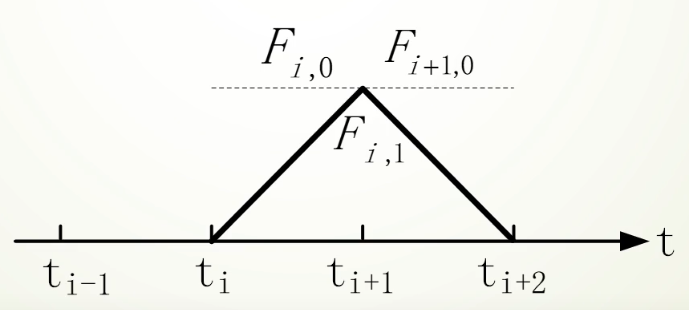

# Bezier&BSpline
`Bezier2.m` 包含了构建二阶（二次）贝塞尔曲线的源代码，而 `Bezier3.m` 专用于创建三阶（三次）贝塞尔曲线。`BSpline.m` 允许通过调整次数（`Degree`）和控制点的数量（`N`），生成B样条曲线。设置这些参数后，可以使用鼠标输入 `N` 个点来可视化结果B样条曲线。

## Bezier曲线

$$
p(t)=\sum_{i=0}^n P_i B_{i, n}(t) \quad t \in[0,1]
$$
1. $P_i(i=0,1 \ldots n)$ 是控制N边形的 $\mathrm{n}+1$个顶点。
2. $B_{i, n}(t)$ 是Bernstein基函数，$P_i$ 代表空间中的点， $t \in[0,1]$，把 $t$ 代进去可以算出一个数, 就是平面或空间的一个点。
3. 随着 $t$ 值的变化, 点也在变化,当 $t$ 从 0 到 1 , 就得到了 Bezier曲线

### 一阶贝塞尔曲线

对于一阶贝塞尔曲线，很容易根据的值得出线段上那个点的坐标：

$$
B_1(t)=P_0+\left(P_1-P_0\right) t
$$

然后可以得出:

$$
B_1(t)=(1-t) P_0+t P_1, t \in[0,1]
$$

### 二阶贝塞尔曲线

对于二阶贝塞尔曲线, 其实你可以理解为: 在 $P_0 P_1$ 上利用一阶公式求出点 $P_0^{\prime}$, 然后在 $P_1 P_2$ 上利用一阶公式求出点 $P_1^{\prime}$, 最后在 $P_0^{\prime} P_1^{\prime}$ 上再利用一阶公式就可以求出最终贝塞尔曲线上的点 $P_0{ }^{\prime \prime}$ 。具体推导过程如下:
先求出线段上的控制点。

$$
\begin{aligned}
& P_0^{\prime}=(1-t) P_0+t P_1 \\
& P_1^{\prime}=(1-t) P_1+t P_2
\end{aligned}
$$

将上面的公式带入至下列公式中:

$$
\begin{aligned}
 B_2(t)&=(1-t) P_0^{\prime}+t P_1^{\prime} \\
& =(1-t)\left((1-t) P_0+t P_1\right)+t\left((1-t) P_1+t P_2\right) \\
& =(1-t)^2 P_0+2 t(1-t) P_1+t^2 P_2
\end{aligned}
$$

得出以下公式:

$$
B_2(t)=(1-t)^2 P_0+2 t(1-t) P_1+t^2 P_2, t \in[0,1]
$$

### 三阶贝塞尔曲线

与二阶贝塞尔曲线类似, 可以通过相同的方法得出以下坐标公式:

$$
B_3(t)=(1-t)^3 P_0+3 t(1-t)^2 P_1+3 t^2(1-t) P_2+t^3 P_3, t \in[0,1]
$$

### 多阶贝塞尔曲线

以此类推可以得到n阶贝塞尔曲线

$$
B(t)=\sum_{i=0}^n C_n^i P_i(1-t)^{n-i} t^i, t \in[0,1]
$$

即:

$$
B(t)=\sum_{i=0}^n P_i b_{i, n}(t), t \in[0,1]
$$

## BSpline

$$
P(t)=\sum_{i=0}^n P_i F_{i, k}(t) \quad t \in\left[t_{k-1}, t_{n+1}\right]
$$

公认的是de Boor-Cox递推定义。其内容简单来说是由0次构造 1 次, 由1次构造 2 次, 由 2 次构造 3 次,以此类推。

递推定义:

$$
\left\{\begin{array}{l}
\mathrm{F}_{i, 0}(t)= \begin{cases}1, & \mathrm{t}_{\mathrm{i}} \leq \mathrm{t} \leq t_{i+1} \\
0, & other \end{cases} \\
\mathrm{F}_{i, k}(t)=\frac{t-t_i}{t_{i+\mathrm{k}}-t_i} F_{i, k-1}(t)+\frac{t_{i+k+1}-t}{t_{i+k+1}-t_{i+1(t)}} F_{i+1, k-1}(t) \\
defining \frac{0}{0}=0
\end{array}\right.
$$

其中$k$表示第$k$次，$i$表示第$i$段时间。

### 零次BSpline

$$
F_{i, 0}(\mathrm{t})= \begin{cases}1, & \text { 若 } \mathrm{t}_{\mathrm{i}} \leq \mathrm{t}<\mathrm{t}_{\mathrm{i}+1} \\ 0, & \text { 其他 }\end{cases}
$$

得到的曲线如下图所示，

### 一次BSpline

$$
\begin{aligned}
F_{\mathrm{i}, 1}(\mathrm{t})&=\frac{\mathrm{t}-\mathrm{t}_{\mathrm{i}}}{\mathrm{t}_{\mathrm{i}+1}-\mathrm{t}_{\mathrm{i}}} F_{\mathrm{i}, 0}(\mathrm{t})+\frac{\mathrm{t}_{\mathrm{i}+2}-\mathrm{t}}{\mathrm{t}_{\mathrm{i}+2}-\mathrm{t}_{\mathrm{i}+1}} F_{\mathrm{i}+1,0}(\mathrm{t})\\
&= \begin{cases}\frac{t-t_i}{t_{i+1}-t_i}, & \text{若 } t_i \leq t<t_{i+1} \\ \frac{t_{i+2}-t}{t_{i+2}-t_{i+1}}, & \text{若 } t_{i+1} \leq t<t_{i+2} \\ 0, & \text{其他}\end{cases}
\end{aligned}
$$

得到的曲线如下所示，

### 二次BSpline

$$
\begin{aligned}
F_{i, 2}(t) &=\frac{t-t_i}{t_{i+2}-t_i} F_{i, 1}(t)+\frac{t_{i+3}-t}{t_{i+3}-t_{i+1}} F_{i+1,1}(t)\\
&= \begin{cases}\frac{t-t_i}{t_{i+2}-t_i} \cdot \frac{t-t_i}{t_{i+1}-t_i}, & \text { 若 } t_i \leq t<t_{i+1} \\ \frac{t-t_i}{t_{i+2}-t_i} \cdot \frac{t_{i+2}-t}{t_{i+2}-t_{i+1}}+\frac{t_{i+3}-t}{t_{i+3}-t_{i+1}} \cdot \frac{t-t_{i+1}}{t_{i+2}-t_{i+1}}, & \text { 若 } t_{i+1} \leq t<t_{i+2} \\ \frac{\left(t_{i+3}-t\right)^2}{\left(t_{i+3}-t_{i+1}\right)\left(t_{i+3}-t_{i+2}\right)}, & \text { 若 } t_{i+2} \leq t<t_{i+3} \\ 0, \quad \text { 其他 } & \end{cases}
\end{aligned}
$$

得到的结果如下所示，

### 三次BSpline

$$
F_{i, 3}(t)=\frac{t-t_i}{t_{i+3}-t_i} F_{i, 2}(t)+\frac{t_{i+4}-t}{t_{i+4}-t_{i+1}} F_{i+1,2}(t)
$$

得到的结果如下所示，

**实际的程序运行结果如下图所示**

例如，**3次BSpline**

**5次BSpline，**

## Reference

https://juejin.cn/post/6844903666361565191

https://github.com/pjbarendrecht/BsplineLab.git
